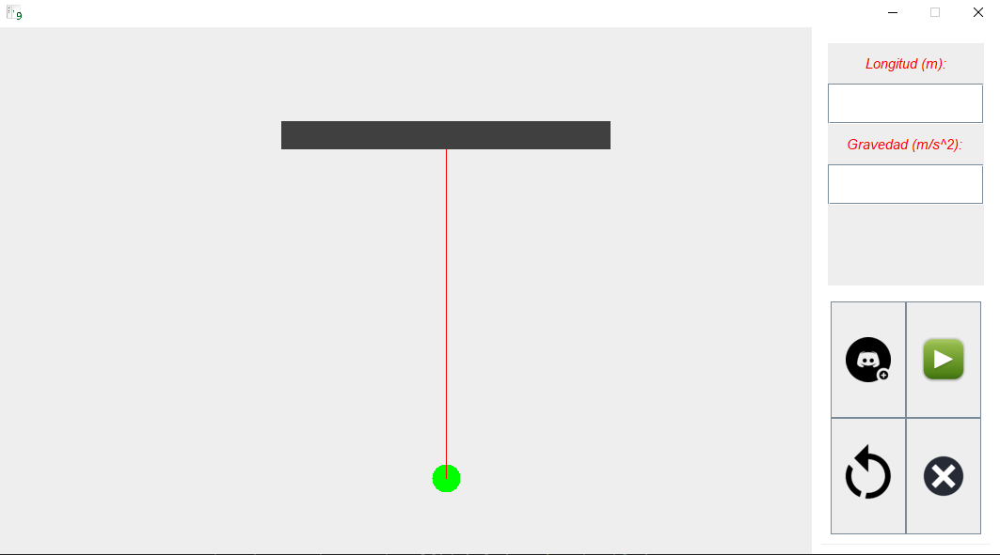

## Descripción

Esta es una pequeña colección de simulaciones construidas en el lenguaje de programación Java. En total podemos encontrar tres de ellas:

## Torricelli.java

Utilizamos algunas ecuaciones diferenciales para describir el comportamiento dinámico de los fluidos dentro de un tanque cilíndrico y los elementos que componen el sistema. Esto nos permitió simular y predecir el rendimiento de los sistemas hidráulicos de acuerdo a diferentes parámetros.
Aquí abordamos la simulación computacional de los sistemas hidráulicos en el lenguaje de programación Java. Esta consiste en un programa simple para simular un modelo virtual y realizar algunos experimentos que nos ayuden a analizar y comprender el rendimiento del sistema.

También anexamos una simple simulación sobre la ley de Torricelli. Esta ley establece que la velocidad de salida de un fluido desde un orificio en un recipiente está relacionada directamente con la altura del fluido sobre el orificio. En el caso de un tanque cilíndrico, esta ley puede aplicarse para determinar el caudal de salida y el tiempo necesario para que el tanque se vacíe por completo.
Para llevar a cabo nuestro estudio, diseñamos una simulación en el que llenamos un tanque cilíndrico con un fluido y medimos la altura del fluido en función del tiempo. Luego, abrimos un orificio en la base del tanque y registramos el tiempo que tardó en vaciarse por completo.

## MainClass.java

Esta simulación fue diseñada en el lenguaje de programación java, consta de cuatro botones: uno para iniciar la simulación, uno para detenerla, uno para reiniciarla y otro para cerrar la ventana; también consta de tres campos de texto: uno para la velocidad inicial en metros por segundo, otro para el ángulo de tiro en grados y otro para la aceleración de la gravedad en metros por segundo al cuadrado; y por ultimo también está conformada por un panel para la visualización de la simulación.

El modelo maneja 10 variables distintas, 8 de entrada como la posición inicial en X y Y (las cuales son constantes), la velocidad inicial (la ingresa el usuario), la gravedad (la ingresa el usuario), el ángulo (la ingresa el usuario), la velocidad inicial y velocidad final (que se calculan a partir de la velocidad inicial y el ángulo de tiro) y el tiempo (que se incrementa automáticamente).

## Pendulo.java

La aplicación es una simulación interactiva del movimiento de un péndulo, donde los usuarios pueden ingresar la longitud del péndulo y la aceleración de la gravedad para observar cómo afectan al comportamiento del péndulo. El usuario puede ajustar la longitud del péndulo para ver cómo cambia el período de oscilación, y también puede modificar la aceleración de la gravedad para observar su impacto en la velocidad y amplitud del péndulo.

## Autor
**ALEXANDER MAESTRE TORRES**

* [LinkedIn](https://www.linkedin.com/in/ajmaestre/)
* [Portfolio web](https://ajmaestre.github.io/portfolio/home)

## Ver ejemplo en github
- [ENLACEGITHUBPAGES](https://github.com/ajmaestre/Simulation_Java)

## Contacto
- [EMAIL](ajmaestretorres@gmail.com)